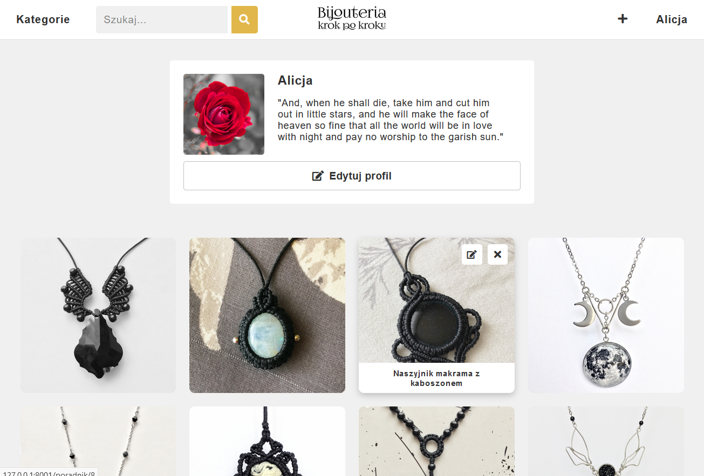

# Bijouteria
Bijouteria is a social network written with PHP framework - Laravel. It enables users to share ideas for jewelry making using step-by-step guides that lead through the various stages of creation. The application was created for beginners who start their adventure with jewelry making and for more advanced people who want to share their knowledge and experience with other users.


## Table of contents
* [Technology](#technology)
* [Installation](#installation)
* [Features](#features)
* [Screenshots](#screenshots)


## Technology
Project is created with:
* Laravel - version 6.5.0

## Installation

1. Clone the repository
	```
	git clone https://github.com/Alakul/Bijouteria.git
	```

2. Switch to the repository folder

3. Install all the dependencies
	```
	composer install
	```

4. Change settings of database connection in .env.example file, then copy it and change the name to .env

5. Generate a new application key
	```
	php artisan key:genarate
	```

6. Create link to the storage
	```
	php artisan storage:link
	```

7. Copy avatar-default.png file from /public/img to storage/app/public/avatarsIMG

8. Run the database seeder
	```
	php artisan db:seed
	```

9. Start the local development server
	```
	php artisan serve
	```


## Features
List of features ready and TODOs for future development
* Authentication
* Creation of guides
* Browsing gallery with guides
* Posting comments
* Changing profile settings
* Favourites list
* Responsivity

To-do list:
* Sorting guides
* Guide rating


## Screenshots
<p>
    
    <em>Home page</em>
</p>
</br>
<p>
    
    <em>Profile</em>
</p>
